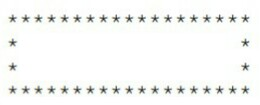
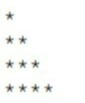

# bhch01: Getting Started

**bhch01exrc01:** Print a box like the one below.  

**bhch01exrc02:** Print a box like the one below.  

**bhch01exrc03:** Print a triangle like the one below.  

**bhch01exrc04:** Write a program that computes and prints the result of `(512 − 282)/(47x48 + 5)`. It is roughly `.1017`.

**bhch01exrc05:** Ask the user to enter a number. Print out the square of the number, but use the `sep` optional argument to print it out in a full sentence that ends in a period. Sample output is shown below.  
> Enter a number: 5  
The square of 5 is 25.

**bhch01exrc06:** Ask the user to enter a number x. Use the `sep` optional argument to print out x, 2x, 3x, 4x, and 5x, each separated by three dashes, like below.  
> Enter a number: 7  
7---14---21---28---35

**bhch01exrc07:** Write a program that asks the user for a weight in kilograms and converts it to pounds. There
are `2.2` pounds in a kilogram.

**bhch01exrc08:** Write a program that asks the user to enter three numbers (use three separate input statements). Create variables called `total` and `average` that hold the sum and average of the
three numbers and print out the values of `total` and `average`.

**bhch01exrc09:** A lot of cell phones have tip calculators. Write one. Ask the user for the price of the meal and
the percent tip they want to leave. Then print both the tip amount and the total bill with the
tip included.
