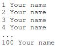
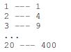
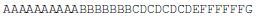
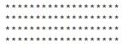
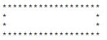
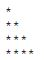
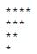
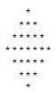
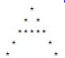

# bhch02: For Loops

**[bhch02exrc01:](bhch02exrc01.py)** Write a program that prints your name 100 times.

**[bhch02exrc02:](bhch02exrc02.py)** Write a program to fill the screen horizontally and vertically with your name. [Hint: add the
option *end=''* into the *print* function to fill the screen horizontally.]

**[bhch02exrc03:](bhch02exrc03.py)** Write a program that outputs 100 lines, numbered 1 to 100, each with your name on it. The
output should look like the output below.  
  

**[bhch02exrc04:](bhch02exrc04.py)** Write a program that prints out a list of the integers from 1 to 20 and their squares. The output
should look like this:  
  

**[bhch02exrc05:](bhch02exrc05.py)** Write a program that uses a for loop to print the numbers 8, 11, 14, 17, 20, . . . , 83, 86, 89.

**[bhch02exrc06:](bhch02exrc06.py)** Write a program that uses a for loop to print the numbers 100, 98, 96, . . . , 4, 2.

**[bhch02exrc07:](bhch02exrc07.py)** Write a program that uses exactly four for loops to print the sequence of letters below.  
  

**[bhch02exrc08:](bhch02exrc08.py)** Write a program that asks the user for their name and how many times to print it. The program
should print out the user’s name the specified number of times.

**[bhch02exrc09:](bhch02exrc09.py)** The Fibonacci numbers are the sequence below, where the first two numbers are 0 and 1, and each
number thereafter is the sum of the two preceding numbers. Write a program that asks the
user how many Fibonacci numbers to print and then prints that many.  
> 1, 1, 2, 3, 5, 8, 13, 21, 34, 55, 89 . . .

**[bhch02exrc10:](bhch02exrc10.py)** Use a for loop to print a box like the one below. Allow the user to specify how wide and how
high the box should be. [Hint: **print**('\*'\*10) prints ten asterisks.]  
  

**[bhch02exrc11:](bhch02exrc11.py)** Use a for loop to print a box like the one below. Allow the user to specify how wide and how
high the box should be.  
  

**[bhch02exrc12:](bhch02exrc12.py)** Use a for loop to print a triangle like the one below. Allow the user to specify how high the
triangle should be.  
  

**[bhch02exrc13:](bhch02exrc13.py)** Use a for loop to print an upside down triangle like the one below. Allow the user to specify
how high the triangle should be.  
  

**[bhch02exrc14:](bhch02exrc14.py)** Use for loops to print a diamond like the one below. Allow the user to specify how high the
diamond should be.  
  

**[bhch02exrc15:](bhch02exrc15.py)** Write a program that prints a giant letter A like the one below. Allow the user to specify how
large the letter should be.  
  
