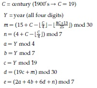

# Chapter 3: Numbers

**[bhch03exrc01.py](bhch03exrc01.py):** Write a program that generates and prints 50 random integers, each between 3 and 6.

**[bhch03exrc02.py](bhch03exrc02.py):** Write a program that generates a random number, x, between 1 and 50, a random number y
between 2 and 5, and computes xy.

**[bhch03exrc03.py](bhch03exrc03.py):** Write a program that generates a random number between 1 and 10 and prints your name
that many times.

**[bhch03exrc04.py](bhch03exrc04.py):** Write a program that generates a random decimal number between 1 and 10 with two decimal
places of accuracy. Examples are 1.23, 3.45, 9.80, and 5.00.

**[bhch03exrc05.py](bhch03exrc05.py):** Write a program that generates 50 random numbers such that the first number is between 1
and 2, the second is between 1 and 3, the third is between 1 and 4, . . . , and the last is between
1 and 51.

**[bhch03exrc06.py](bhch03exrc06.py):** Write a program that asks the user to enter two numbers, x and y, and computes 
(|x-y|)/(x+y)

**[bhch03exrc07.py](bhch03exrc07.py):** Write a program that asks the user to enter an angle between -1800 and 1800. Using an
expression with the modulo operator, convert the angle to its equivalent between 00 and
3600.

**[bhch03exrc08.py](bhch03exrc08.py):** Write a program that asks the user for a number of seconds and prints out how many minutes
and seconds that is. For instance, 200 seconds is 3 minutes and 20 seconds. [Hint: Use the //
operator to get minutes and the % operator to get seconds.]

**[bhch03exrc09.py](bhch03exrc09.py):** Write a program that asks the user for an hour between 1 and 12 and for how many hours in
the future they want to go. Print out what the hour will be that many hours into the future.
An example is shown below.
>Enter hour: 8  
How many hours ahead? 5  
New hour: 1 o'clock

**[bhch03exrc10.py](bhch03exrc10.py):**  
1) One way to find out the last digit of a number is to mod the number by 10. Write a
program that asks the user to enter a power. Then find the last digit of 2 raised to that
power.
2) One way to find out the last two digits of a number is to mod the number by 100. Write
a program that asks the user to enter a power. Then find the last two digits of 2 raised to
that power.
3) Write a program that asks the user to enter a power and how many digits they want.
Find the last that many digits of 2 raised to the power the user entered.

**[bhch03exrc11.py](bhch03exrc11.py):** Write a program that asks the user to enter a weight in kilograms. The program should
convert it to pounds, printing the answer rounded to the nearest tenth of a pound.

**[bhch03exrc12.py](bhch03exrc12.py):** Write a program that asks the user for a number and prints out the factorial of that number.

**[bhch03exrc13.py](bhch03exrc13.py):** Write a program that asks the user for a number and then prints out the sine, cosine, and
tangent of that number.

**[bhch03exrc14.py](bhch03exrc14.py):** Write a program that asks the user to enter an angle in degrees and prints out the sine of that
angle.

**[bhch03exrc15.py](bhch03exrc15.py):** Write a program that prints out the sine and cosine of the angles ranging from 0 to 3450 in
150 increments. Each result should be rounded to 4 decimal places. Sample output is shown
below:  
>0 --- 0.0 1.0  
15 --- 0.2588 0.9659  
30 --- 0.5 0.866  
...  
345 --- -0.2588 0.9659  

**[bhch03exrc16.py](bhch03exrc16.py):** Below is described how to find the date of Easter in any year. Despite its intimidating appearance,
this is not a hard problem. Note that |\_x\_| is the floor function, which for positive numbers
just drops the decimal part of the number. For instance |\_3.14\_| = 3. The floor function is part
of the math module.  
  
Easter is either March (22+d+e) or April (d+e-9). There is an exception if d = 29 and e = 6.
In this case, Easter falls one week earlier on April 19. There is another exception if d = 28,
e = 6, and m = 2, 5, 10, 13, 16, 21, 24, or 39. In this case, Easter falls one week earlier on April 18.  
Write a program that asks the user to enter a year and prints out the date of Easter in that
year. (See Tattersall, *Elementary Number Theory in Nine Chapters*, 2nd ed., page 167)

**[bhch03exrc17.py](bhch03exrc17.py):** A year is a leap year if it is divisible by 4, except that years divisible by 100 are not leap years
unless they are also divisible by 400. Ask the user to enter a year, and, using the // operator,
determine how many leap years there have been between 1600 and that year.

**[bhch03exrc18.py](bhch03exrc18.py):** Write a program that given an amount of change less than $1.00 will print out exactly how
many quarters, dimes, nickels, and pennies will be needed to efficiently make that change.
[Hint: the // operator may be useful.]

**[bhch03exrc19.py](bhch03exrc19.py):** Write a program that draws “modular rectangles” like the ones below. The user specifies the
width and height of the rectangle, and the entries start at 0 and increase typewriter fashion
from left to right and top to bottom, but are all done mod 10. Below are examples of a 3 x 5
rectangle and a 4 x 8.
>0 1 2 3 4  
5 6 7 8 9  
0 1 2 3 4  
0 1 2 3 4 5 6 7  
8 9 0 1 2 3 4 5  
6 7 8 9 0 1 2 3  
4 5 6 7 8 9 0 1  
