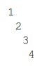

# Chapter 06: Strings

**[bhch06exrc01.py](bhch06exrc01.py):**  
Write a program that asks the user to enter a string. The program should then print the
following:  
(a) The total number of characters in the string  
(b) The string repeated 10 times  
(c) The first character of the string (remember that string indices start at 0)  
(d) The first three characters of the string  
(e) The last three characters of the string  
(f) The string backwards  
(g) The seventh character of the string if the string is long enough and a message otherwise  
(h) The string with its first and last characters removed  
(i) The string in all caps  
(j) The string with every *a* replaced with an *e*  
(k) The string with every letter replaced by a space  

**[bhch06exrc02.py](bhch06exrc02.py):**  
A simple way to estimate the number of words in a string is to count the number of spaces
in the string. Write a program that asks the user for a string and returns an estimate of how
many words are in the string.

**[bhch06exrc03.py](bhch06exrc03.py):**  
People often forget closing parentheses when entering formulas. Write a program that asks
the user to enter a formula and prints out whether the formula has the same number of opening and closing parentheses.

**[bhch06exrc04.py](bhch06exrc04.py):**  
Write a program that asks the user to enter a word and prints out whether that word contains
any vowels.

**[bhch06exrc05.py](bhch06exrc05.py):**  
Write a program that asks the user to enter a string. The program should create a new string
called *new_string* from the user’s string such that the second character is changed to an
asterisk and three exclamation points are attached to the end of the string. Finally, print
*new_string*. Typical output is shown below:
>Enter your string: Qbert  
Q*ert!!!

**[bhch06exrc06.py](bhch06exrc06.py):**  
Write a program that asks the user to enter a string *s* and then converts *s* to lowercase, removes all the periods and commas from *s*, and prints the resulting string.

**[bhch06exrc07.py](bhch06exrc07.py):**  
Write a program that asks the user to enter a word and determines whether the word is a
palindrome or not. A palindrome is a word that reads the same backwards as forwards.

**[bhch06exrc08.py](bhch06exrc08.py):**  
At a certain school, student email addresses end with *@student.college.edu*, while professor email addresses end with *@prof.college.edu*. Write a program that first asks the
user how many email addresses they will be entering, and then as the user enter those addresses. After all the email addresses are entered, the program should print out a message
indicating either that all the addresses are student addresses or that there were some professor addresses entered.

**[bhch06exrc09.py](bhch06exrc09.py):**  
Ask the user for a number and then print the following, where the pattern ends at the number
that the user enters.  
  

**[bhch06exrc10.py](bhch06exrc10.py):**  
Write a program that asks the user to enter a string, then prints out each letter of the string
doubled and on a separate line. For instance, if the user entered HEY, the output would be
>HH  
EE  
YY

**[bhch06exrc11.py](bhch06exrc11.py):**  
Write a program that asks the user to enter a word that contains the letter *a*. The program
should then print the following two lines: On the first line should be the part of the string up
to and including the the first *a*, and on the second line should be the rest of the string. Sample
output is shown below:
> Enter a word: buffalo  
buffa  
lo

**[bhch06exrc12.py](bhch06exrc12.py):**  
Write a program that asks the user to enter a word and then capitalizes every other letter of
that word. So if the user enters *rhinoceros*, the program should print *rHiNoCeRoS*.

**[bhch06exrc13.py](bhch06exrc13.py):**  
Write a program that asks the user to enter two strings of the same length. The program
should then check to see if the strings are of the same length. If they are not, the program
should print an appropriate message and exit. If they are of the same length, the program
should alternate the characters of the two strings. For example, if the user enters *abcde* and
*ABCDE* the program should print out *AaBbCcDdEe*.

**[bhch06exrc14.py](bhch06exrc14.py):**  
Write a program that asks the user to enter their name in lowercase and then capitalizes the
first letter of each word of their name.

**[bhch06exrc15.py](bhch06exrc15.py):**  
When I was a kid, we used to play this game called *Mad Libs*. The way it worked was a friend
would ask me for some words and then insert those words into a story at specific places
and read the story. The story would often turn out to be pretty funny with the words I had
given since I had no idea what the story was about. The words were usually from a specific
category, like a place, an animal, etc.
For this problem you will write a *Mad Libs* program. First, you should make up a story and
leave out some words of the story. Your program should ask the user to enter some words
and tell them what types of words to enter. Then print the full story along with the inserted
words. Here is a small example, but you should use your own (longer) example:
>Enter a college class: CALCULUS  
Enter an adjective: HAPPY  
Enter an activity: PLAY BASKETBALL  
CALCULUS class was really HAPPY today. We learned how to
PLAY BASKETBALL today in class. I can't wait for tomorrow's
class!

**[bhch06exrc16.py](bhch06exrc16.py):**  
Companies often try to personalize their offers to make them more attractive. One simple
way to do this is just to insert the person’s name at various places in the offer. Of course,
companies don’t manually type in every person’s name; everything is computer-generated.
Write a program that asks the user for their name and then generates an offer like the one
below. For simplicity’s sake, you may assume that the person’s first and last names are one
word each.
> Enter name: George Washington  
Dear George Washington,  
> I am pleased to offer you our new Platinum Plus Rewards card
at a special introductory APR of 47.99%. George, an offer
like this does not come along every day, so I urge you to call
now toll-free at 1-800-314-1592. We cannot offer such a low
rate for long, George, so call right away.

**[bhch06exrc17.py](bhch06exrc17.py):**  
Write a program that generates the 26-line block of letters partially shown below. Use a loop
containing one or two print statements.
> abcdefghijklmnopqrstuvwxyz  
bcdefghijklmnopqrstuvwxyza  
cdefghijklmnopqrstuvwxyzab  
...  
yzabcdefghijklmnopqrstuvwx  
zabcdefghijklmnopqrstuvwxy  

**[bhch06exrc18.py](bhch06exrc18.py):**  
The goal of this exercise is to see if you can mimic the behavior of the **in** operator and the
*count* and *index* methods using only variables, for loops, and if statements.  
(a) Without using the *in* operator, write a program that asks the user for a string and a letter
and prints out whether or not the letter appears in the string.  
(b) Without using the *count* method, write a program that asks the user for a string and a
letter and counts how many occurrences there are of the letter in the string.  
(c) Without using the *index* method, write a program that asks the user for a string and
a letter and prints out the index of the first occurrence of the letter in the string. If the
letter is not in the string, the program should say so.

**[bhch06exrc19.py](bhch06exrc19.py):**  
Write a program that asks the user for a large integer and inserts commas into it according
to the standard American convention for commas in large numbers. For instance, if the user
enters *1000000*, the output should be *1,000,000*.

**[bhch06exrc20.py](bhch06exrc20.py):**  
Write a program that converts a time from one time zone to another. The user enters the time
in the usual American way, such as *3:48pm* or *11:26am*. The first time zone the user enters
is that of the original time and the second is the desired time zone. The possible time zones
are *Eastern*, *Central*, *Mountain*, or *Pacific*.
> Time: 11:48pm  
Starting zone: Pacific  
Ending zone: Eastern  
2:48am  

**[bhch06exrc21.py](bhch06exrc21.py):**  
An anagram of a word is a word that is created by rearranging the letters of the original.
For instance, two anagrams of idle are *deli* and *lied*. Finding anagrams that are real words is
beyond our reach until Chapter 12. Instead, write a program that asks the user for a string
and returns a random anagram of the string—in other words, a random rearrangement of the
letters of that string.

**[bhch06exrc22.py](bhch06exrc22.py):**  
A simple way of encrypting a message is to rearrange its characters. One way to rearrange the
characters is to pick out the characters at even indices, put them first in the encrypted string,
and follow them by the odd characters. For example, the string *message* would be encrypted
as *msaeesg* because the even characters are *m*, *s*, *a*, *e* (at indices 0, 2, 4, and 6) and the odd
characters are *e*, *s*, *g* (at indices 1, 3, and 5).  
(a) Write a program that asks the user for a string and uses this method to encrypt the string.  
(b) Write a program that decrypts a string that was encrypted with this method.  

**[bhch06exrc23.py](bhch06exrc23.py):**  
A more general version of the above technique is the *rail fence cipher*, where instead of breaking things into evens and odds, they are broken up by threes, fours or something larger. For
instance, in the case of threes, the string *secret message* would be broken into three groups. The
first group is *sr sg*, the characters at indices 0, 3, 6, 9 and 12. The second group is *eemse*, the
characters at indices 1, 4, 7, 10, and 13. The last group is *ctea*, the characters at indices 2, 5, 8,
and 11. The encrypted message is *sr sgeemsectea*.  
(a) Write a program that asks the user for a string and uses the rail fence cipher in the threes
case to encrypt the string.  
(b) Write a decryption program for the threes case.  
(c) Write a program that asks the user for a string, and an integer determining whether to
break things up by threes, fours, or whatever. Encrypt the string using the rail-fence
cipher.  
(d) Write a decryption program for the general case.

**[bhch06exrc24.py](bhch06exrc24.py):**  
In calculus, the derivative of x4 is 4x3. The derivative of x5 is 5x4. The derivative of x6 is 
6x5. This pattern continues. Write a program that asks the user for input like x^3 or x^25
and prints the derivative. For example, if the user enters x^3, the program should print out
3x^2.

**[bhch06exrc25.py](bhch06exrc25.py):**  
In algebraic expressions, the symbol for multiplication is often left out, as in 3x+4y or 3(x+5).
Computers prefer those expressions to include the multiplication symbol, like *3\*x+4\*y* or
*3\*(x+5)*. Write a program that asks the user for an algebraic expression and then inserts
multiplication symbols where appropriate.