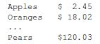
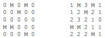
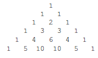

# Chapter 10: Miscellaneous topics 2

---
[bhch10exrc01.py](bhch10exrc01.py): Write a program that uses *list* and *range* to create the list [3,6,9, .... , 99].

---
[bhch10exrc02.py](bhch10exrc02.py): Write a program that asks the user for a weight in kilograms. The program should convert the weight to kilograms, formatting the result to one decimal place.

---
[bhch10exrc03.py](bhch10exrc03.py): Write a program that asks the user to enter a word. Rearrange all the letters of the word in alphabetical order and print out the resulting word. For example, *abracadabra* should become *aaaaabbcdrr*.

---
[bhch10exrc04.py](bhch10exrc04.py): Write a program that takes a list of ten prices and ten products, applies an 11% discount to each of the prices displays the output like below, right-justified and nicely formatted.  

---
[bhch10exrc05.py](bhch10exrc05.py): Use the following two lists and the *format* method to create a list of card names in the format *card value* of *suit name* (for example, 'Two of Clubs').
>suits = ['Hearts', 'Diamonds', 'Clubs', 'Spades']  
values = ['One', 'Two', 'Three', 'Four', 'Five', 'Six', 'Seven', 'Eight', 'Nine', 'Ten', 'Jack', 'Queen', 'King', 'Ace']

---
[bhch10exrc06.py](bhch10exrc06.py): Write a program that uses a boolean flag variable in determining whether two lists have any items in common.

---
[bhch10exrc07.py](bhch10exrc07.py): Write a program that creates the list [1, 11, 111, 1111, ..., 111...1], where the entries have an ever increasing number of ones, with the last entry having 100 ones.

---
[bhch10exrc08.py](bhch10exrc08.py): Write a program to find all numbers between 1 and 1000 that are divisible by 7 and end in a 6.

---
[bhch10exrc09.py](bhch10exrc09.py): Write a program to determine how many of the numbers between 1 and 10000 contain the digit 3.

---
[bhch10exrc10.py](bhch10exrc10.py): Adding certain numbers to their reversals sometimes produces a palindromic number. For instance, 241 + 142 = 383. Sometimes, we have to repeat the process. For instance, 84 + 48 = 132 and 132 + 231 = 363. Write a program that finds both two-digit numbers for which this process must be repeated more than 20 times to obtain a palindromic number.

---
[bhch10exrc11.py](bhch10exrc11.py): Write a program that finds all pairs of six-digit palindromic numbers that are less than 20 apart. One such pair is 199991 and 200002.

---
[bhch10exrc12.py](bhch10exrc12.py): The number 1961 reads the same upside-down as right-side up. Print out all the numbers between 1 and 100000 that read the same upside-down as right-side up.

---
[bhch10exrc13.py](bhch10exrc13.py): The number 99 has the property that if we multiply its digits together and then add the sum of its digits to that, we get back to 99. That is, (9 x 9) + (9 + 9) = 99. Write a program to find all of the numbers less than 10000 with this property. (There are only nine of them.)

---
[bhch10exrc14.py](bhch10exrc14.py): Write a program to find the smallest positive integer that satisfies the following property: If you take the leftmost digit and move it all the way to the right, the number thus obtained is exactly 3.5 times larger than the original number. For instance, if we start with 2958 and move the 2 all the way to the right, we get 9582, which is roughly 3.2 times the original number.

---
[bhch10exrc15.py](bhch10exrc15.py): Write a program to determine how many zeroes 1000! ends with.

---
[bhch10exrc16.py](bhch10exrc16.py): Write a program that converts a decimal height in feet into feet and inches. For instance, an input of 4.75 feet should become 4 feet, 9 inches.

---
[bhch10exrc17.py](bhch10exrc17.py): Write a program that repeatedly asks the user to enter a height in the format *feet'inches"* (like 5'11" or 6'3". The user indicates they are done entering heights by entering *done*. The program should return a count of how many 4-footers, 5-footers, 6-footers, and 7-footers were entered.

---
[bhch10exrc18.py](bhch10exrc18.py): Write a program that repeatedly asks the user to enter a football score in the format *winning score-losing score* (like 27-13 or 21-3). The user indicates they are done entering scores by entering *done*. The program should then output the highest score and the lowest score out of all the scores entered.

---
[bhch10exrc19.py](bhch10exrc19.py): Write a program that repeatedly asks the user to enter a birthday in the format *month/day* (like *12/25* or *2/14*). The user indicates they are done entering birthdays by entering *done*. The program should return a count of how many of those birthdays are in February and how many are on the 25th of some month (any month).

---
[bhch10exrc20.py](bhch10exrc20.py): Write a program that asks the user to enter a date in the format *mm/dd/yy* and converts it to a more verbose format. For example, *02/04/77* should get converted into *February 4, 1977*.

---
[bhch10exrc21.py](bhch10exrc21.py): Write a program that asks the user to enter a fraction in the form of a string like *'1/2'* or *'8/24'*. The program should reduce the fraction to lowest terms and print out the result.

---
[bhch10exrc22.py](bhch10exrc22.py): Write a program to find all four solutions to the following problem: If a starfruit is worth $5, a mango is worth $3, and three oranges together cost $1, how many starfruits, mangoes, and oranges, totaling 100, can be bought for $100?

---
[bhch10exrc23.py](bhch10exrc23.py): The currency of a strange country has coins worth 7 cents and 11 cents. Write a program to determine the largest purchase price that cannot be paid using these two coins.

---
[bhch10exrc24.py](bhch10exrc24.py): Here is an old puzzle you can solve using brute force by using a computer program to check all the possibilities: In the calculation 43 + 57 = 207, every digit is precisely one away from its true value. What is the correct calculation?

---
[bhch10exrc25.py](bhch10exrc25.py): Write a program that finds all integer solutions to Pell’s equation x2 - 2y2 = 1, where x and y are between 1 and 100.

---
[bhch10exrc26.py](bhch10exrc26.py): Write a program that asks the user for a number and prints out all the ways to write the number as difference of two perfect squares, x2 - y2, where x and y are both between 1 and 1000. Writing a number as a difference of two squares leads to clever techniques for factoring large numbers.

---
[bhch10exrc27.py](bhch10exrc27.py): Write a program that simulates all possible rolls of four dice and for each simulated roll, finds the sums of pairs of dice. For instance, if the roll is 5 1 2 4, the sums are 6, 8, 9, 3 ,5, and 6. For each of the possible sums from 2 to 12, find the total number of simulated rolls in which the sum appears and what percentage of the simulated rolls had those sums appear. Output the totals and percentages, nicely formatted, with the percentages formatted to one decimal place. To check your work, you should find that the sum 2 comes up in 171 rolls, which is 13.2% of the rolls.

---
[bhch10exrc28.py](bhch10exrc28.py): In a magic square, each row, each column, and both diagonals add up to the same number. A partially filled magic square is shown below. Write a program to check through all the possibilities to fill in the magic square.
>5 _ _  
_ 6 2  
3 8 _

---
[bhch10exrc29.py](bhch10exrc29.py): The following is useful as part of a program to play *Minesweeper*. Suppose you have a 5 x 5 list that consists of zeros and M’s. Write a program that creates a new 5x5 list that has M’s in the same place, but the zeroes are replaced by counts of how many M’s are in adjacent cells (adjacent either horizontally, vertically, or diagonally). An example is shown below. [Hint: short-circuiting may be helpful for avoiding index-out-of-range errors.]  

---
[bhch10exrc30.py](bhch10exrc30.py): Pascal’s triangle is shown below. On the outside are 1’s and each other number is the sum of the two numbers directly above it. Write a program to generate Pascal’s triangle. Allow the user to specify the number of rows. Be sure that it is nicely formatted, like below.  

---
[bhch10exrc31.py](bhch10exrc31.py): Given two dates entered as strings in the form mm/dd/yyyy where the years are between 1901 and 2099, determine how many days apart they are. Here is a bit of information that may be useful: Leap years between 1901 and 2099 occur exactly every four years, starting at 1904. February has 28 days, 29 during a leap year. November, April, June, and September each have 30 days. The other months have 31 days.

---
[bhch10exrc32.py](bhch10exrc32.py): Monte Carlo simulations can be used to estimate all sorts of things, including probabilities of coin flip and dice events. As an example, to estimate the probability of rolling a pair of sixes with two dice, we could use random integers to simulate the dice and run the simulation thousands of times, counting what percentage of the time a pair of sixes comes up.  
(a) Estimate the probability of rolling a *Yahtzee* in a single roll of five dice. That is estimate the probability that when rolling five dice they all come out to be the same number.  
(b) Estimate the probability of rolling a large straight in a single roll of five dice. A large straight is a roll where the dice come out 1-2-3-4-5 or 2-3-4-5-6 in any order.  
(c) Estimate the average longest run of heads or tails when flipping a coin 200 times.  
(d) Estimate the average number of coin flips it takes before five heads in a row come up.  
(e) Estimate the average number of coin flips it takes before the string *s* comes up, where *s* is a string of heads and tails, like *HHTTH*.

---