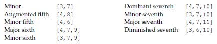

# Chapter 11: Dictionaries

---
[bhch11exrc01.py](bhch11exrc01.py): Write a program that repeatedly asks the user to enter product names and prices. Store all of these in a dictionary whose keys are the product names and whose values are the prices. When the user is done entering products and prices, allow them to repeatedly enter a product name and print the corresponding price or a message if the product is not in the dictionary.

---
[bhch11exrc02.py](bhch11exrc02.py): Using the dictionary created in the previous problem, allow the user to enter a dollar amount and print out all the products whose price is less than that amount.

---
[bhch11exrc03.py](bhch11exrc03.py): For this problem, use the dictionary from the beginning of this chapter whose keys are month names and whose values are the number of days in the corresponding months.  
(a) Ask the user to enter a month name and use the dictionary to tell them how many days are in the month.  
(b) Print out all of the keys in alphabetical order.  
(c) Print out all of the months with 31 days.  
(d) Print out the (key-value) pairs sorted by the number of days in each month.  
(e) Modify the program from part (a) and the dictionary so that the user does not have to know how to spell the month name exactly. That is, all they have to do is spell the first three letters of the month name correctly.

---
[bhch11exrc04.py](bhch11exrc04.py): Write a program that uses a dictionary that contains ten user names and passwords. The program should ask the user to enter their username and password. If the username is not in the dictionary, the program should indicate that the person is not a valid user of the system. If the username is in the dictionary, but the user does not enter the right password, the program should say that the password is invalid. If the password is correct, then the program should tell the user that they are now logged in to the system.

---
[bhch11exrc05.py](bhch11exrc05.py): Repeatedly ask the user to enter a team name and the how many games the team won and how many they lost. Store this information in a dictionary where the keys are the team names and the values are lists of the form [wins, losses].  
(a) Using the dictionary created above, allow the user to enter a team name and print out the team’s winning percentage.  
(b) Using the dictionary, create a list whose entries are the number of wins of each team.  
(c) Using the dictionary, create a list of all those teams that have winning records.

---
[bhch11exrc06.py](bhch11exrc06.py): Repeatedly ask the user to enter game scores in a format like *team1 score1 - team2 score2*. Store this information in a dictionary where the keys are the team names and the values are lists of the form [*wins*, *losses*].

---
[bhch11exrc07.py](bhch11exrc07.py): Create a 5x5 list of numbers. Then write a program that creates a dictionary whose keys are the numbers and whose values are the how many times the number occurs. Then print the three most common numbers.

---
[bhch11exrc08.py](bhch11exrc08.py): Using the card dictionary from earlier in this chapter, create a simple card game that deals two players three cards each. The player with the highest card wins. If there is a tie, then compare the second highest card and, if necessary, the third highest. If all three cards have the same value, then the game is a draw.

---
[bhch11exrc09.py](bhch11exrc09.py): Using the card dictionary from earlier in the chapter, deal out three cards. Determine the following:  
(a) If the three cards form a flush (all of the same suit)  
(b) If there is a three-of-a-kind (all of the same value)  
(c) If there is a pair, but not three-of-a-kind  
(d) If the three cards form a straight (all in a row, like (2, 3, 4) or (10, Jack, Queen))

---
[bhch11exrc10.py](bhch11exrc10.py): Using the card dictionary from earlier in the chapter run a Monte Carlo simulation to estimate the probability of being dealt a flush in a five card hand. See Exercise 32 of Chapter 10 ([bhch10exrc32.py](../bhch10/bhch10exrc32.py)) for more about Monte Carlo simulations.

---
[bhch11exrc11.py](bhch11exrc11.py): In Section 6.10 we met the substitution cipher. This cipher replaces every letter with a different letter. For instance every *a* might be replaced with an *e*, every *b* might be replaced with an *a*, etc. Write a program that asks the user to enter two strings. Then determine if the second string could be an encoded version of the first one with a substitution cipher. For instance, CXYZ is not an encoded version of BOOK because O got mapped to two separate letters. Also, CXXK is not an encoded version of BOOK, because K got mapped to itself. On the other hand, CXXZ would be an encoding of BOOK. This problem can be done with or without a dictionary.

---
[bhch11exrc12.py](bhch11exrc12.py): Below are the notes used in music:
>C C# D D# E F F# G G# A A# B  

The notes for the C major chord are C, E, G. A mathematical way to get this is that E is 4 steps past C and G is 7 steps past C. This works for any base. For example, the notes for D major are D, F#, A. We can represent the major chord steps as a list with two elements: [4, 7]. The corresponding lists for some other chord types are shown below:  
  
||||||
|---|---|---|---|---|
|Minor |[3,7] ||Dominant seventh |[4,7,10]|
|Augmented fifth |[4,8] ||Minor seventh |[3,7,10]|  
|Minor fifth |[4,6] ||Major seventh |[4,7,11]|
|Major sixth |[4,7,9] ||Diminished seventh |[3,6,10]|
|Minor sixth |[3,7,9]||||

Write a program that asks the user for the key and the chord type and prints out the notes of the chord. Use a dictionary whose keys are the (musical) keys and whose values are the lists of steps.

---
[bhch11exrc13.py](bhch11exrc13.py): Suppose you are given the following list of strings:  
> L = ['aabaabac', 'cabaabca', 'aaabbcba', 'aabacbab', 'acababba']

Patterns like this show up in many places, including DNA sequencing. The user has a string of their own with only some letters filled in and the rest as asterisks. An example is a\*\*a\*\*\*\*. The user would like to know which of the strings in the list fit with their pattern. In the example just given, the matching strings are the first and fourth. One way to solve this problem is to create a dictionary whose keys are the indices in the user’s string of the non-asterisk characters and whose values are those characters. Write a program implementing this approach (or some other approach) to find the strings that match a user-entered string.

---
[bhch11exrc14.py](bhch11exrc14.py): Dictionaries provide a convenient way to store structured data. Here is an example dictionary:  
>d=[{'name':'Todd', 'phone':'555-1414', 'email':'todd@mail.net'},  
{'name':'Helga', 'phone':'555-1618', 'email':'helga@mail.net'},  
{'name':'Princess', 'phone':'555-3141', 'email':''},  
{'name':'LJ', 'phone':'555-2718', 'email':'lj@mail.net'}]  

Write a program that reads through any dictionary like this and prints the following:  
(a) All the users whose phone number ends in an 8  
(b) All the users that don’t have an email address listed  

---
[bhch11exrc15.py](bhch11exrc15.py): The following problem is from Chapter 6. Try it again, this time using a dictionary whose keys are the names of the time zones and whose values are offsets from the Eastern time zone.  
Write a program that converts a time from one time zone to another. The user enters the time  in the usual American way, such as *3:48pm* or *11:26am*. The first time zone the user enters is that of the original time and the second is the desired time zone. The possible time zones are *Eastern*, *Central*, *Mountain*, or *Pacific*.
>Time: 11:48pm  
Starting zone: Pacific  
Ending zone: Eastern  
2:48am  

---
[bhch11exrc16.py](bhch11exrc16.py): (a) Write a program that converts Roman numerals into ordinary numbers. Here are the conversions: M=1000, D=500, C=100, L=50, X=10, V=5 I=1. Don’t forget about things like IV being 4 and XL being 40.  
(b) Write a program that converts ordinary numbers into Roman numerals.  

___