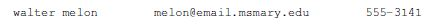
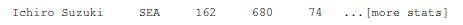

# Chapter 12: Text Files

---
[bhch12exrc01.py](bhch12exrc01.py): You are given a file called *class_scores.txt*, where each line of the file contains a oneword username and a test score separated by spaces, like below:
>GWashington 83  
JAdams 86  

Write code that scans through the file, adds 5 points to each test score, and outputs the usernames and new test scores to a new file, *scores2.txt*.

---
[bhch12exrc02.py](bhch12exrc02.py): You are given a file called *grades.txt*, where each line of the file contains a one-word student username and three test scores separated by spaces, like below:
>GWashington 83 77 54  
JAdams 86 69 90  

Write code that scans through the file and determines how many students passed all three
tests.

---
[bhch12exrc03.py](bhch12exrc03.py): You are given a file called *logfile.txt* that lists log-on and log-off times for users of a system. A typical line of the file looks like this:
> Van Rossum, 14:22, 14:37

Each line has three entries separated by commas: a username, a log-on time, and a log-off time. Times are given in 24-hour format. You may assume that all log-ons and log-offs occur within a single workday.  
Write a program that scans through the file and prints out all users who were online for at least an hour.

---
[bhch12exrc04.py](bhch12exrc04.py): You are given a file called *students.txt*. A typical line in the file looks like:
  
>walter melon	melon@email.msmary.edu	555-3141

There is a name, an email address, and a phone number, each separated by tabs. Write a program that reads through the file line-by-line, and for each line, capitalizes the  first letter of the first and last name and adds the area code 301 to the phone number. Your program should write this to a new file called *students2.txt*. Here is what the first line of the new file should look like:  
  
>Walter Melon	melon@email.msmary.edu	301-555-3141

---
[bhch12exrc05.py](bhch12exrc05.py): You are given a file *namelist.txt* that contains a bunch of names. Some of the names are a first name and a last name separated by spaces, like *George Washington*, while others have a middle name, like *John Quincy Adams*. There are no names consisting of just one word or more than three words. Write a program that asks the user to enter initials, like GW or JQA, and prints all the names that match those initials. Note that initials like JA should match both *John Adams* and *John Quincy Adams*.

---
[bhch12exrc06.py](bhch12exrc06.py): You are given a file *namelist.txt* that contains a bunch of names. Print out all the names in the list in which the vowels *a*, *e*, *i*, *o*, and *u* appear in order (with repeats possible). The first vowel in the name must be *a* and after the first *u*, it is okay for there to be other vowels. An example is *Ace Elvin Coulson*.

---
[bhch12exrc07.py](bhch12exrc07.py): You are given a file called *baseball.txt*. A typical line of the file starts like below.  

>Ichiro Suzuki	SEA	162	680	74	...[more stats]

Each entry is separated by a tab, \t. The first entry is the player’s name and the second is their team. Following that are 16 statistics. Home runs are the seventh stat and stolen bases are the eleventh. Print out all the players who have at least 20 home runs and at least 20 stolen bases.

---
[bhch12exrc08.py](bhch12exrc08.py): For this problem, use the file of NCAA basketball scores as described in Section 12.3.  
(a) Find the average of the points scored over all the games in the file.  
(b) Pick your favorite team and scan through the file to determine how many games they
won and how many games they lost.  
(c) Find the team(s) that lost by 30 or more points the most times  
(d) Find all the teams that averaged at least 70 points a game.  
(e) Find all the teams that had winning records but were collectively outscored by their
opponents. A team is collectively outscored by their opponents if the total number of
points the team scored over all their games is less than the total number of points their
opponents scored in their games against the team.

---
[bhch12exrc09.py](bhch12exrc09.py): Benford’s law states that in real data where the values are spread across several orders of magnitude, about 30% of the values will start with the number 1, whereas only about 4.6% of the values will start with the number 9. This is contrary to what we might expect, namely that values starting with 1 and 9 would be equally likely. Using the file *expenses.txt* which consists of a number of costs from an expense account, determine what percentage start with each of the digits 1 through 9. This technique is used by accountants to detect fraud.

---
[bhch12exrc10.py](bhch12exrc10.py): Wordplay – Use the file *wordlist.txt* for this problem. Find the following:  
(a) All words ending in *ime*  
(b) All words whose second, third, and fourth letters are *ave*  
(c) How many words contain at least one of the letters *r*, *s*, *t*, *l*, *n*, *e*  
(d) The percentage of words that contain at least one of the letters *r*, *s*, *t*, *l*, *n*, *e*  
(e) All words with no vowels  
(f) All words that contain every vowel  
(g) Whether there are more ten-letter words or seven-letter words  
(h) The longest word in the list  
(i) All palindromes  
(j) All words that are words in reverse, like *rat* and *tar*.  
(k) Same as above, but only print one word out of each pair.  
(l) All words that contain double letters next each other like *aardvark* or *book*, excluding words that end in *lly*  
(m) All words that contain a *q* that isn’t followed by a *u*  
(n) All words that contain *zu* anywhere in the word  
(o) All words that contain *ab* in multiple places, like *habitable*  
(p) All words with four or more vowels in a row  
(q) All words that contain both a *z* and a *w*  
(r) All words whose first letter is *a*, third letter is *e* and fifth letter is *i*  
(s) All two-letter words  
(t) All four-letter words that start and end with the same letter  
(u) All words that contain at least nine vowels.  
(v) All words that contain each of the letters *a*, *b*, *c*, *d*, *e*, and *f* in any order. There may be other letters in the word. Two examples are *backfield* and *feedback*.  
(w) All words whose first four and last four letters are the same  
(x) All words of the form *abcd\*dcba*, where * is arbitrarily long sequence of letters.  
(y) All groups of 5 words, like *pat pet pit pot put*, where each word is 3 letters, all words share the same first and last letters, and the middle letter runs through all 5 vowels.  
(z) The word that has the most i’s.  

---
[bhch12exrc11.py](bhch12exrc11.py): Write a program to help with word games. The user enters a word and the program uses the wordlist to determine if the user’s word is a real word or not.

---
[bhch12exrc12.py](bhch12exrc12.py): Suppose we write all the words in the wordlist backwards and then arrange these backwards words alphabetically. Write a program that prints the last word in this modified wordlist.

---
[bhch12exrc13.py](bhch12exrc13.py): Print out all combinations of the string *'Python'* plus a three letter English word. Capitalize the first letter of the three letter word. Example combinations are *'PythonCat'*, *'PythonDog'*, and *'PythonTag'*. These are valid combinations because *cat*, *dog*, and *tag* are English words. On the other hand, *'PythonQqz'* would not be a valid combination because *qqz* is not an English word. Use a wordlist to determine which three letter combinations are words.

---
[bhch12exrc14.py](bhch12exrc14.py): Write a simple spell-checking program. The user should enter a string and the program should print out a list of all the words it thinks are misspelled. These would be all the words it cannot find in a wordlist.

---
[bhch12exrc15.py](bhch12exrc15.py): Crossword cheater: When working on a crossword puzzle, often you will have a word where you know several of the letters, but not all of them. You can write a computer program to help you. For the program, the user should be able to input a word with the letters they know filled in and asterisks for those they don’t know. The program should print out a list of all words that fit that description. For example, the input th\*\*\*ly should return all the words that could work, namely thickly and thirdly.

---
[bhch12exrc16.py](bhch12exrc16.py): Ask the user to enter several letters. Then find all the words that can be made with those letters, repeats allowed.

---
[bhch12exrc17.py](bhch12exrc17.py): Using the wordlist, produce a dictionary whose keys are the letters *a* through *z* and whose values are the percentage of words that use that letter.

---
[bhch12exrc18.py](bhch12exrc18.py): Using the wordlist, produce a dictionary whose keys are the letters *a* through *z* and whose values are the percentage of total letters in the wordlist that are that letter.

---
[bhch12exrc19.py](bhch12exrc19.py): Write a program that asks the user for a word and finds all the smaller words that can be made from the letters of that word. The number of occurrences of a letter in a smaller word can’t exceed the number of occurrences of the letter in the user’s word.

---
[bhch12exrc20.py](bhch12exrc20.py): (a) Write a program that reads a file consisting of email addresses, each on its own line. Your program should print out a string consisting of those email addresses separated by semicolons.  
(b) Write the same program as above, but the new string should contain only those email
addresses that do not end in *@prof.college.edu*.

---
[bhch12exrc21.py](bhch12exrc21.py): The file *high_temperatures.txt* contains the average high temperatures for each day of the year in a certain city. Each line of the file consists of the date, written in the month/day format, followed by a space and the average high temperature for that date. Find the 30-day period over which there is the biggest increase in the average high temperature.

---
[bhch12exrc22.py](bhch12exrc22.py): In Chapter 6 there was an exercise about the game Mad Libs. It asked you to make up a story and leave out some words of the story. Your program should ask the user to enter some words and tell them what types of words to enter. Then print the full story along with the inserted words. Rewrite your program from that exercise to read the story from a file. Reading the story from a file allows people who do not know how to program to use their own stories with the program without having to change the code.

---
[bhch12exrc23.py](bhch12exrc23.py): An acronym is an abbreviation that uses the first letter of each word in a phrase. We see them everywhere. For instance, NCAA for National Collegiate Athletic Association or NBC for National Broadcasting Company. Write a program where the user enters an acronym and the program randomly selects words from a wordlist such that the words would fit the acronym. Below is some typical output generated when I ran the program:
>Enter acronym: ABC  
['addressed', 'better', 'common']  

>Enter acronym: BRIAN  
['bank', 'regarding', 'intending', 'army', 'naive']

---
[bhch12exrc24.py](bhch12exrc24.py): This problem is about a version of the game *Jotto*. The computer chooses a random five-letter word with no repeat letters. The player gets several turns to try to guess the computer’s word. On each turn, the player guesses a five-letter word and is told the number of letters that their guess has in common with the computer’s word.

---
[bhch12exrc25.py](bhch12exrc25.py): The word *part* has the interesting property that if you remove its letters one by one, each resulting step is a real word. For instance, *part->pat->pa->a*. You may remove the letters in any order, and the last (single-letter) word needs to be a real word as well. Find all eight-letter words with this property.

---
[bhch12exrc26.py](bhch12exrc26.py): Write a program to cheat at the game *Scrabble*. The user enters a string. Your program should return a list of all the words that can be created from those seven letters.

---