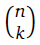
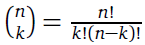

# Chapter 13: Functions

---
[bhch13exrc01.py](bhch13exrc01.py): Write a function called *rectangle* that takes two integers *m* and *n* as arguments and prints out an *mxn* box consisting of asterisks. Shown below is the output of rectangle(2,4)
> \*\*\*\*  
\*\*\*\*

---
[bhch13exrc02.py](bhch13exrc02.py): (a) Write a function called *add_excitement* that takes a list of strings and adds an exclamation point (!) to the end of each string in the list. The program should modify the original list and not return anything.  
(b) Write the same function except that it should not modify the original list and should instead return a new list.

---
[bhch13exrc03.py](bhch13exrc03.py): Write a function called *sum_digits* that is given an integer *num* and returns the sum of the digits of *num*.

---
[bhch13exrc04.py](bhch13exrc04.py): The *digital root* of a number *n* is obtained as follows: Add up the digits *n* to get a new number. Add up the digits of that to get another new number. Keep doing this until you get a number that has only one digit. That number is the digital root.  
For example, if n = 45893, we add up the digits to get 4 + 5 + 8 + 9 + 3 = 29. We then add up the digits of 29 to get 2 + 9 = 11. We then add up the digits of 11 to get 1 + 1 = 2. Since 2 has only one digit, 2 is our digital root.  
Write a function that returns the digital root of an integer n. [Note: there is a shortcut, where the digital root is equal to n mod 9, but do not use that here.]

---
[bhch13exrc05.py](bhch13exrc05.py): Write a function called *first_diff* that is given two strings and returns the first location in which the strings differ. If the strings are identical, it should return -1.

---
[bhch13exrc06.py](bhch13exrc06.py): Write a function called *binom* that takes two integers *n* and *k* and returns the binomial coefficient (n  k). The definition is (n  k) = n!/(k!(n-k)!).

---
[bhch13exrc07.py](bhch13exrc07.py): Write a function that takes an integer *n* and returns a random integer with exactly *n* digits. For instance, if *n* is 3, then 125 and 593 would be valid return values, but 093 would not because that is really 93, which is a two-digit number.

---
[bhch13exrc08.py](bhch13exrc08.py): Write a function called *number_of_factors* that takes an integer and returns how many factors the number has.

---
[bhch13exrc09.py](bhch13exrc09.py): Write a function called *factors* that takes an integer and returns a list of its factors.

---
[bhch13exrc10.py](bhch13exrc10.py): Write a function called *closest* that takes a list of numbers *L* and a number *n* and returns the largest element in *L* that is not larger than *n*. For instance, if L=[1,6,3,9,11] and n=8, then the function should return 6, because 6 is the closest thing in L to 8 that is not larger than 8. Don’t worry about if all of the things in L are smaller than n.

---
[bhch13exrc11.py](bhch13exrc11.py): Write a function called *matches* that takes two strings as arguments and returns how many matches there are between the strings. A match is where the two strings have the same character at the same index. For instance, 'python' and 'path' match in the first, third, and fourth characters, so the function should return 3.

---
[bhch13exrc12.py](bhch13exrc12.py): Recall that if *s* is a string, then `s.find('a')` will find the location of the *first a* in *s*. The problem is that it does not find the location of every a. Write a function called *findall* that given a string and a single character, returns a list containing all of the locations of that character in the string. It should return an empty list if there are no occurrences of the character
in the string.

---
[bhch13exrc13.py](bhch13exrc13.py): Write a function called *change_case* that given a string, returns a string with each upper case letter replaced by a lower case letter and vice-versa.

---
[bhch13exrc14.py](bhch13exrc14.py): Write a function called *is_sorted* that is given a list and returns `True` if the list is sorted and `False` otherwise.

---
[bhch13exrc15.py](bhch13exrc15.py): Write a function called *root* that is given a number x and an integer n and returns x^(1/n). In the function definition, set the default value of n to 2.

---
[bhch13exrc16.py](bhch13exrc16.py): Write a function called *one_away* that takes two strings and returns True if the strings are of the same length and differ in exactly one letter, like *bike/hike* or *water/wafer*.

---
[bhch13exrc17.py](bhch13exrc17.py): (a) Write a function called *primes* that is given a number *n* and returns a list of the first *n* primes. Let the default value of n be 100.  
(b) Modify the function above so that there is an optional argument called *start* that allows the list to start at a value other than 2. The function should return the first *n* primes that are greater than or equal to start. The default value of start should be 2.

---
[bhch13exrc18.py](bhch13exrc18.py): Our number system is called *base 10* because we have ten digits: 0, 1, . . . , 9. Some cultures, including the Mayans and Celts, used a base 20 system. In one version of this system, the 20 digits are represented by the letters A through T. Here is a table showing a few conversions:
|10-20|10-20|10-20|10-20|
|---|---|---|---|
|0-A|8-I|16-Q|39-BT|
|1-B|9-J|17-R|40-CA|
|2-C|10-K|18-S|41-CB|
|3-D|11-L|19-T|60-DA|
|4-E|12-M|20-BA|399-TT|
|5-F|13-N|21-BB|400-BAA|
|6-G|14-O|22-BC|401-BAB|
|7-H|15-P|23-BD|402-BAC|

Write a function called *base20* that converts a base 10 number to base 20. It should return the result as a string of base 20 digits. One way to convert is to find the remainder when the number is divided by 20, then divide the number by 20, and repeat the process until the number is 0. The remainders are the base 20 digits in reverse order, though you have to convert them into their letter equivalents

---
[bhch13exrc19.py](bhch13exrc19.py): Write a function called *verbose* that, given an integer less than 10^15, returns the name of the integer in English. As an example, `verbose(123456)` should return *one hundred twenty-three thousand, four hundred fifty-six*.

---
[bhch13exrc20.py](bhch13exrc20.py): Write a function called *merge* that takes two already sorted lists of possibly different lengths, and merges them into a single sorted list.  
(a) Do this using the *sort* method.
(b) Do this without using the *sort* method.

---
[bhch13exrc21.py](bhch13exrc21.py): In Chapter 12, the way we checked to see if a word *w* was a real word was:  
>`if w in words:`  

where words was the list of words generated from a wordlist. This is unfortunately slow, but there is a faster way, called a binary search. To implement a binary search in a function, start by comparing w with the middle entry in *words*. If they are equal, then you are done and the function should return `True`. On the other hand, if w comes before the middle entry, then search the first half of the list. If it comes after the middle entry, then search the second half of the list. Then repeat the process on the appropriate half of the list and continue until the word is found or there is nothing left to search, in which case the function short return `False`. The < and > operators can be used to alphabetically compare two strings.

---
[bhch13exrc22.py](bhch13exrc22.py): A Tic-tac-toe board can be represented be a 3x3 two-dimensional list, where zeroes stand for empty cells, ones stand for X’s and twos stand for O’s.  
(a) Write a function that is given such a list and randomly chooses a spot in which to place a 2. The spot chosen must currently be a 0 and a spot must be chosen.  
(b) Write a function that is given such a list and checks to see if someone has won. Return *True* if there is a winner and *False* otherwise.

---
[bhch13exrc23.py](bhch13exrc23.py): Write a function that is given a 9 x 9 potentially solved Sudoku and returns `True` if it is solved correctly and `False` if there is a mistake. The Sudoku is correctly solved if there are no repeated numbers in any row or any column or in any of the nine "blocks".

---